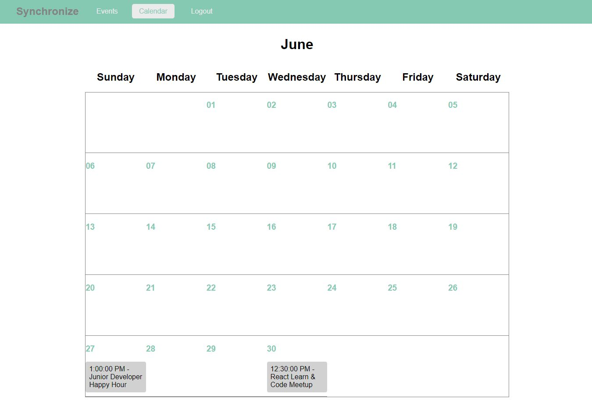

# Synchronize

## Date: 6/18/2021

### By: Luke Arenas

#### [Website]([https://www.lukearenas.com](https://github.com/LukeArenas)) | [GitHub](https://github.com/LukeArenas) | [LinkedIn](https://www.linkedin.com/in/lukearenas/)

---

### ***Description***

Synchronize is a great way to discover and sign up for events. Users are able to create their own events as well as book events created by others. Once a event is booked, it will add it to your personal calendar.

### **Check out my deployed project** [HERE](https://pure-river-50083.herokuapp.com/auth)

***

### ***Project Planning***

 #### [Workflow](https://trello.com/b/n9YX5e20/calendar) | [Dataflow](https://app.diagrams.net/#G1iuuckF6ZhX8E_mvVp2JS1sxk-ISOj-k9)

***

### ***Technologies***

* React
* GraphQL
* MongoDB

***

### ***Background***

This project was my first implementation of GraphQL. I learned a lot from it and was even able to go back and refactor my schema to modify what results are returned for the bookings. On the React frontend side, it was also a learning experience figuring out how to create a calendar from scratch and it required a lot of logic and data formatting. Overall, I hope to revisit this project and contiue to refactor and refine it's functionality.

### ***Screenshots***

***

### ***Future Updates***

- [ ] Mobile friendly
- [ ] Order events by date
- [ ] Only fetch events for future dates

***

### ***Credits***

* [Academind GraphQL Tutorial](https://www.youtube.com/playlist?list=PL55RiY5tL51rG1x02Yyj93iypUuHYXcB_)